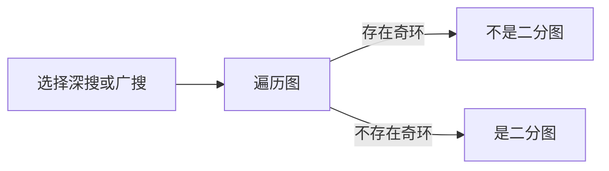

# 二分图

## 定义

二分图 (Bipartite graph), 所有的点被分为 *U*, *V* 两个集合, 使得所有的边都满足: 一个点在 *U* 中, 另一个点在 *V* 中.

## 性质

* *U*, *V* 集合内部没有边
* 不存在长度为奇数的环

## 判定方法

## 最大匹配

| 概念           | 定义                                                         |
|----------------|--------------------------------------------------------------|
| 匹配            | 图的一个子集，任意两条边没有公共顶点，点为匹配点，边为匹配边 |
| 最大匹配         | 边数最多的匹配                                                |
| 完美匹配         | 所有点均为匹配点的匹配                                          |
| 交替路           | 从匹配点出发，依次经过非匹配边、匹配边、非匹配边等的路径         |
| 增广路           | 从匹配点出发，沿着交替路走，非匹配边比匹配边多一条，可改进匹配      |
| 最少点覆盖数      | 选择最少的点，使每条边至少有一个端点被选择                         |

* 最大匹配数 = 最少点覆盖数

### 相互喜欢的最大匹配问题

**题目**

多个男女, 已知每个人喜欢的对象, 最多可配几对, 使得每对间都相互喜欢.

**解法**

匈牙利算法: 从一未匹配边开始, 运行 DFS 来扩充增广路

**实现**

[import](../../src/graph/bipartite_graph_maximum_matching.h)

[import](../../tests/test_bipartite_graph.cpp)

## References

1. [二分图 - OI Wiki](https://oi-wiki.org/graph/bi-graph/)
1. [二分图的最大匹配、完美匹配和匈牙利算法 - Blog - Renfei Song](https://www.renfei.org/blog/bipartite-matching.html)
